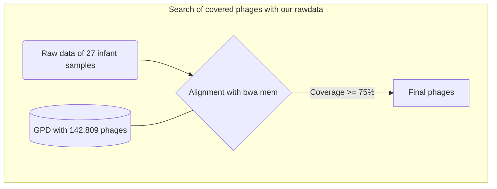

# Antimicrobial Peptides in Phages from gut microbiota
1. [Objetives](#1)
2. [Search of covered phages (GDP) with our rawdata](#1)

## 1. Objetives 
1. Know the AMPs present in the infant gut phages
2. Determinate the AMPs differentially abundant between groups

## 2. Search of covered phages with our rawdata 

### Pipeline

