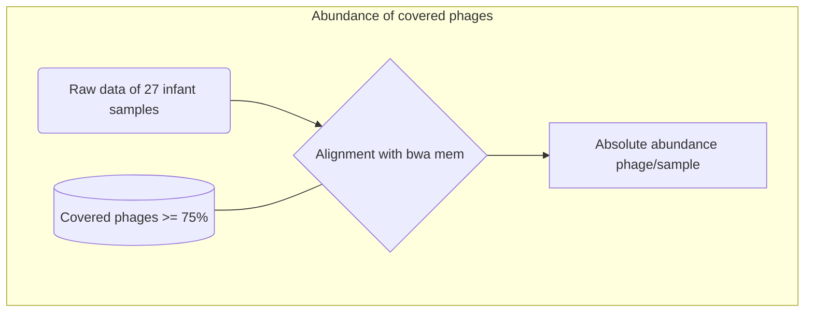

# Antimicrobial Peptides in Phages from gut microbiota
1. [Objetives](#1)
2. [Search of covered phages (GDP) with our rawdata](#2)
3. [Abundance of covered phages](#3)
3. [Search of AMPs in phages](#4)

## 1. Objetives
1. Know the AMPs present in the infant gut phages
2. Determinate the AMPs differentially abundant between groups

## 2. Search of covered phages with our rawdata

**[Log](./03_logs/phages_log_13062022.ipynb)**

**[Scripts]()**

## 3. Abundance of covered phages

 
**[Log](./03_logs/phages_log_13062022.ipynb)**

**[Scripts]()**

## 4. Search of AMPs in phages

**[Log](./03_logs/phages_log_13062022.ipynb)**

**[Scripts]()**
